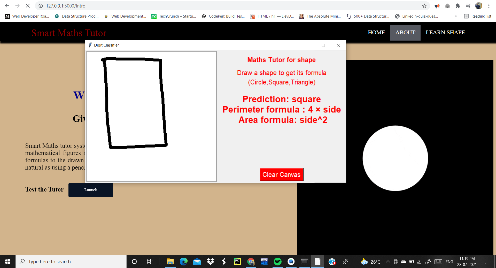
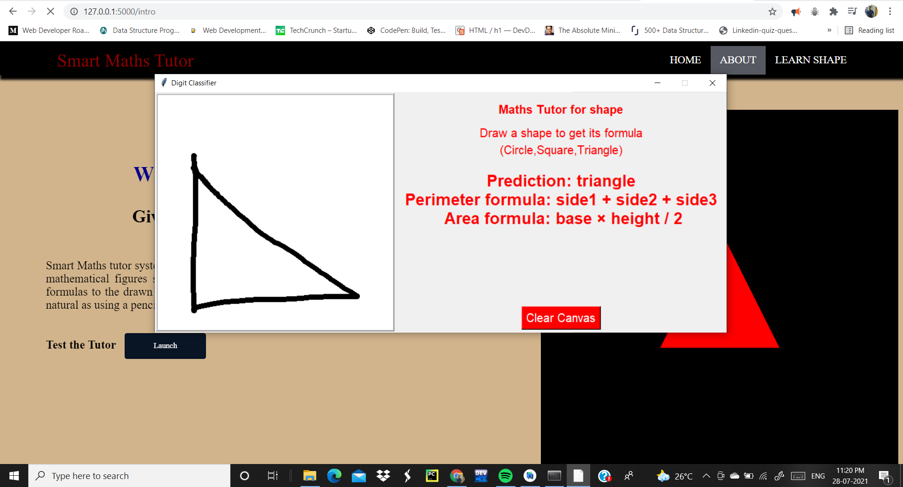
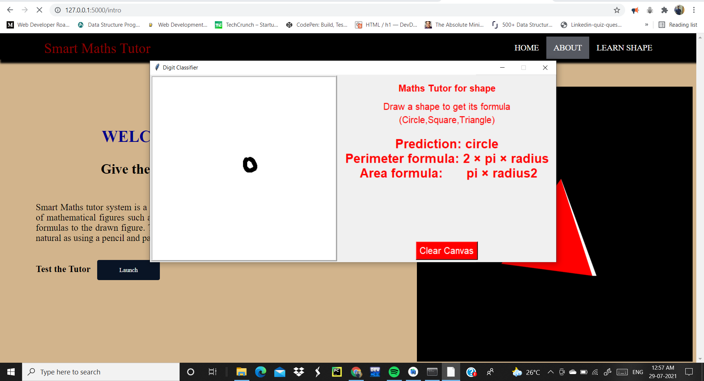
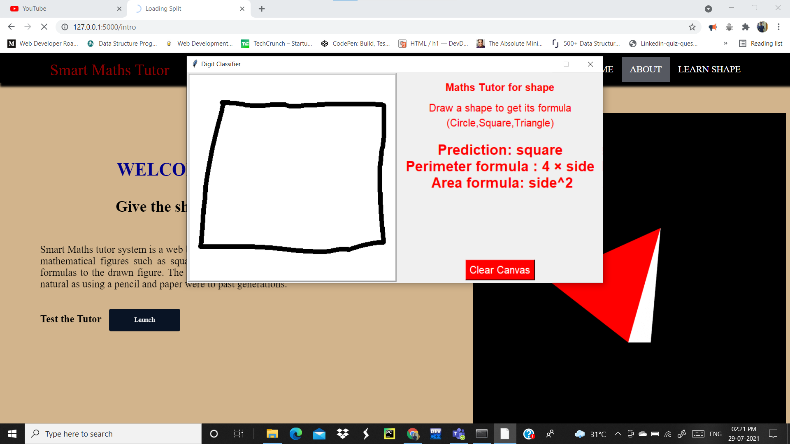

# SI-GuidedProject-4653-1626957128
Smart Maths tutor system is a web based graphical user interface where a user gets to draw shapes of mathematical figures such as square, triangle, circle etc. for which the output would be related formulas to the drawn figure.
[Video Demo of the Smart Maths tutor system](https://drive.google.com/file/d/1qCdk6PJr1ud6CnfLHxN1N5tnRLKB62uj/view?usp=sharing)

